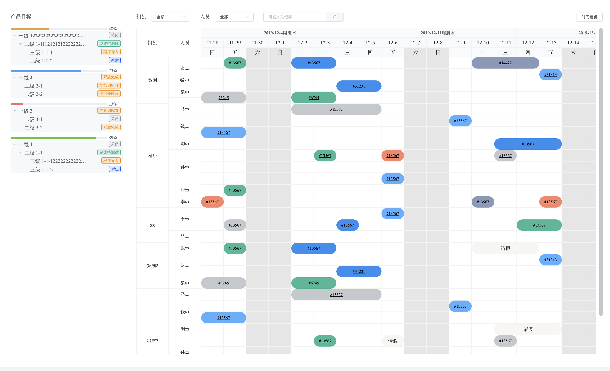
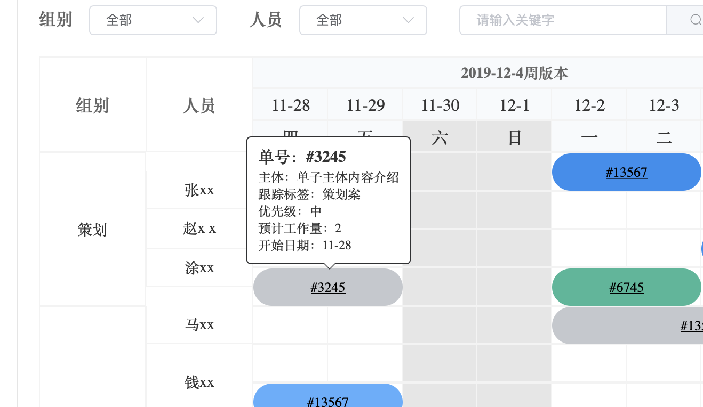

# tt-gantt
vue甘特图组件

##### 左侧树状图显示各任务完成进度，右侧甘特图进行任务详情查看，或者调整时间，状态调整（暂未添加该功能）





## Project setup
```
npm install
```

### Compiles and hot-reloads for development
```
npm run serve
```

### Compiles and minifies for production
```
npm run build
```

### Customize configuration
See [Configuration Reference](https://cli.vuejs.org/config/).
